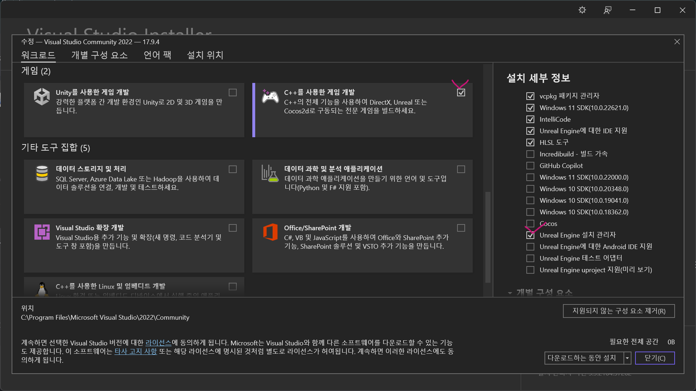

### The SDK 'Microsoft.NET.SDK.WorkloadAutoImportPropsLocator' specified could not be found. 오류

해결책

- **Visual Studio 2022 Install**
   
    

### Unable to build while Live Coding is active. Exit the editor and game, or press Ctrl+Alt+F11 if iterating on code in the editor or game

해결책

- 만약 다른 Unreal Proj이 열려있다면 닫는다.    
- 컴퓨터 재부팅    
- Unreal Project를 통해 Generate Visual Studio project files 실행
   - 

